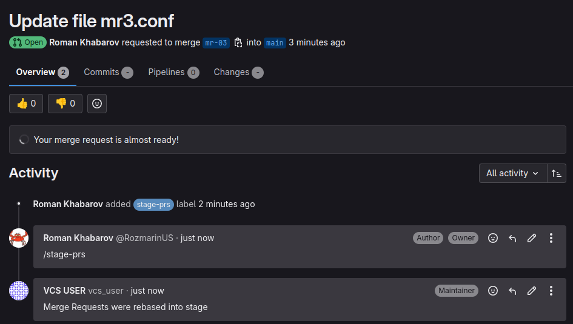

# Gitlab MR Combiner
Merge multiple merge requests into a single branch in GitLab using tags.

## How is it works?
1) Start the application
2) Configure a webhook to send a request when receiving a comment in a merge request (MR) in GitLab<br>
URL looks like: http://your-server.tld:8080/webhook
3) The application receives the request
4) The application retrieves all MRs with a unique tag
5) Clone the repository
6) Merge all MRs into one branch
7) Push the changes into branch

## Installation
### Docker
You can install this in docker:
```bash
docker run -d --rm --name gitlab-mr-combiner \
  -p 8080:8080 \
  -e TRIGGER_MESSAGE="/specific-message" \
  -e TARGET_BRANCH="target_branch" \
  -e TRIGGER_TAG="specific_tag" \
  -e GITLAB_TOKEN="<your access_token>" \
  -e GITLAB_URL="<your_gitlab_url>, default is https://gitlab.com" \
  -v ~/.ssh:/root/.ssh:ro \
  globalartltd/gitlab-mr-combiner
```
### Kubernetes
[You can install using helm chart](https://github.com/GlobalArtInc/helm-charts/tree/master/charts/gitlab-mr-combiner)

**You must store the SSH private key of any user who has access to the repository!**<br />
In this example, we mount it from the volume.

## Setup
1) Create a webhook for the group or repository, selecting the trigger: Comments.
2) In the project settings, create a specific tag from your Docker environment, for example: `stage-mr`.
3) Apply this tag to all merge requests (MRs) that you want to merge.
4) Send `/specific-message` from the Docker environment.

## Screenshot
